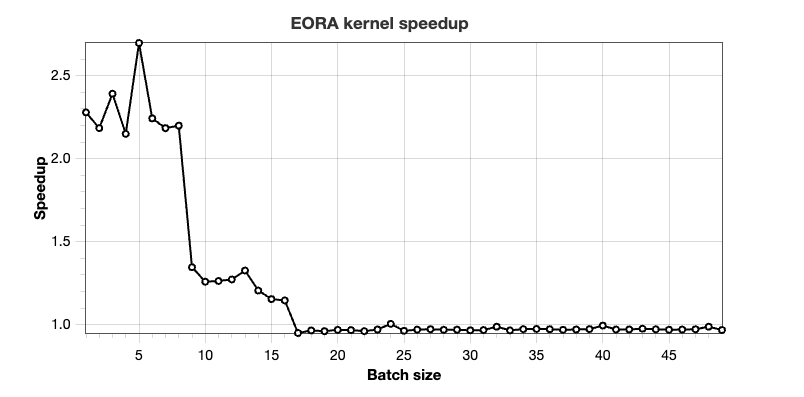

# GPTQ-eora

## Introduction

Draft implementation of 4-bit CUDA kernel for "EoRA: Training-free Compensation for Compressed LLM with Eigenspace Low-Rank Approximation" (https://arxiv.org/abs/2410.21271) paper. 
The implementation is bootstrapped from vllm implementation of gptq: https://github.com/vllm-project/vllm/tree/f0ef37233ea0ba5251edaea7362984110411e7eb/csrc/quantization/gptq 
by forking `gemm_half_q_half_gptq_4bit_kernel` into `gemm_half_q_half_gptq_4bit_kernel_eora`, which accepts additional input: `Ax` and `B` matrices along with LORA rank.

To see the delta between the proposed and the original implementation one can diff `q_gemm.cu` and `q_gemm_original.cu` ignoring whitespaces and blank lines. 

## Getting started
- install miniconda https://docs.anaconda.com/miniconda/install/ 
- `conda create -n test-eora  python=3.12 pip`
- `conda activate test-eora`
- `conda install -c conda-forge libstdcxx-ng` # to avoid ` version `GLIBCXX_3.4.32' not found` error
- `pip install  -r requirements.txt` 
- `pip install .`
- `pytest test_eora.py` # correctness test
- `python3 benchmark.py` # benchmarking

### Benchmarking results:
Speedup ranging between ~2.3x and 1.2x is observed for batch sizes ranging from 1 to 16 on a single RTX 3090 GPU. 
The baseline is `gptq kernel + pytorch for LORA` is compared with `gptq eora kernel`.

